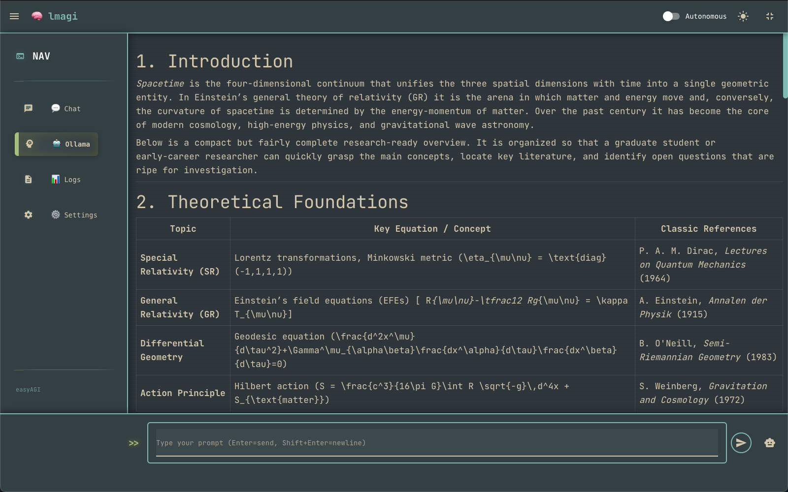
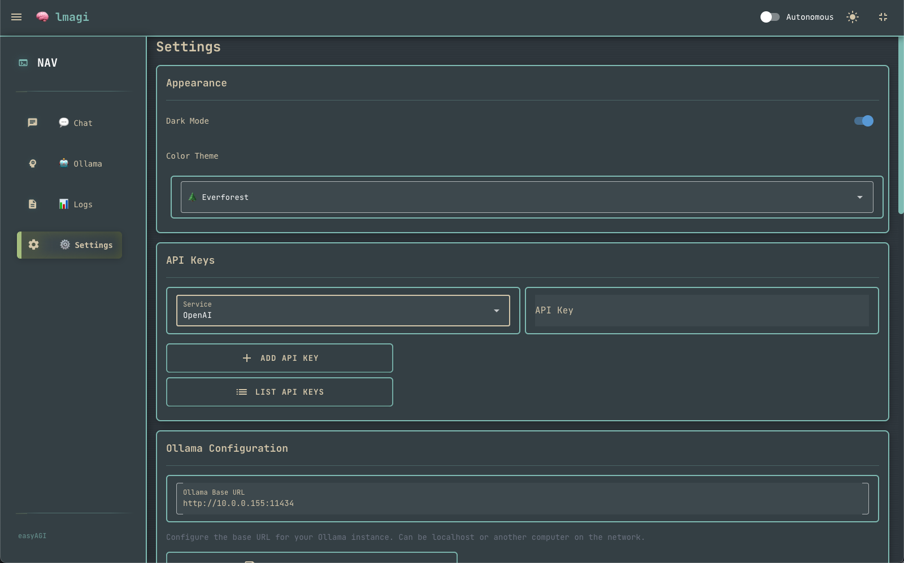

# <a href="https://rage.pythai.net/introducing-kuntai-deepdive/">lmagi</a> thinking machine<br />
# local model Augmented Generative Intelligence
# ollama models are recognized in the ollama tab


<a href="https://github.com/easyAGI/fastAGI/blob/main/automind/display_helpers.py">display helpers</a><br /> 
# lmAGI
language model Augmented Generative Intelligence<br />
lmagi showcases multi-model reasoning with persistent memory and a modern web UI powered by NiceGUI. The preferred way to run is via the native desktop wrapper `lmagi_gui.py`, which launches the backend and embeds the web app.
local model / language model Augmented Generative Intelligence<br />
this is the development version of ezAGI becoming lmagi on route to <a href="https://github.com/easyAGI/easyAGI/">easyAGI</a> roadmap to display the reasoning capabilities as log files<br />
integration with ollama point of departure can be found at <a href="https://github.com/llamagi/lmagi">lmagi</a><br />
project development has migrated to the <a href="https://github.com/easyAGI/">easyAGI</a> roadmap<br />

Project development aligns with the <a href="https://github.com/easyAGI/">easyAGI</a> roadmap.<br />
Source code: <a href="https://github.com/llamagi/lmagi">lmagi</a>

An exercise in multi-model integration for LLM rational enhancement.<br />

```python
aug·ment·ed
/ôɡˈmen(t)əd/

adjective: augmented
    having been made greater in size or value
```

```python
gen·er·a·tive
/ˈjen(ə)rədiv,ˈjenəˌrādiv/

adjective: generative

    denoting an approach to any field of linguistics that involves applying a finite set of rules to linguistic input in order to produce all and only the well-formed items of a language
    relating to or capable of production or reproduction
```

```python
in·tel·li·gence
/inˈteləj(ə)ns/

noun: intelligence

    the ability to acquire and apply knowledge and skills
```

lmAGI
An expression of enhanced reasoning for LLM with `./memory/stm` and advanced log files that highlight internal reasoning as a working concept of machine reasoning.

# Requirements
Python ≥ 3.9<br />
pip<br />

API keys (one or more):<br />
<a href="https://console.groq.com/docs/quickstart">Groq API key</a> • <a href="https://openai.com/index/openai-api/">OpenAI API key</a> • <a href="https://api.together.xyz/signin?redirectUrl=/settings/api-keys">Together.ai API key</a>


## Quick Start (macOS & Linux)

```bash
git clone https://github.com/llamagi/lmagi
cd lmagi
chmod +x setup.sh
./setup.sh  # creates ./venv, installs deps, scaffolds .env
```

Run the GUI (recommended):
```bash
source venv/bin/activate
python lmagi_gui.py
```

Run the backend directly (browser opens automatically):
```bash
source venv/bin/activate
python lmagi.py  # serves at http://localhost:8080
```

## Quick Start (Windows)

Open Command Prompt and run:
```bash
git clone https://github.com/llamagi/lmagi
cd lmagi
python -m venv venv
venv\Scripts\activate
pip install -r requirements.txt
python lmagi_gui.py
```

If `pip` is not on PATH, you may need:
```bash
python -m pip install -r requirements.txt
```

## Usage

- Open the app (GUI or `python lmagi.py` → `http://localhost:8080`).
- Go to Settings → API Keys to add one or more provider keys.
- Return to Chat and select the model/provider in the footer menu.
- Start chatting; autonomous reasoning can be toggled from the header.

Chat example:


Adding API keys:



